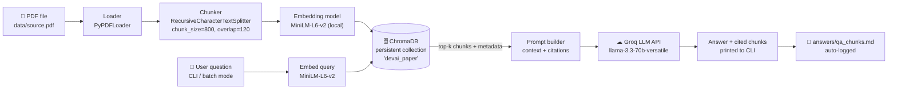

# RAG Workflow — Agent-as-a-Judge Chatbot

This document describes the end-to-end Retrieval-Augmented Generation (RAG)
pipeline used in this project to answer questions about the paper
**"Agent-as-a-Judge: Evaluate Agents with Agents"** (arXiv:2410.10934).

---

## Pipeline Diagram

---

## Stage Descriptions

### 1. Load
`PyPDFLoader` (LangChain Community) reads every page of `data/source.pdf` and
produces one `Document` per page, with `metadata['page']` (0-indexed) and
`metadata['source']` preserved for downstream citation.

### 2. Chunk
`RecursiveCharacterTextSplitter` breaks each page into overlapping chunks
(`chunk_size=800`, `chunk_overlap=120` characters). A stable `chunk_id`
(`"<page>-<index>"`) is attached to each chunk's metadata so answers can
cite the exact chunk.

### 3. Embed (Ingest-time)
All chunks are batch-embedded locally using
`sentence-transformers/all-MiniLM-L6-v2` — no API call, no cost, fully
offline. The 384-dimensional embeddings are stored alongside the chunk text
and metadata in ChromaDB.

### 4. Store
`chromadb.PersistentClient` writes the collection to disk at `chroma_db/`
(gitignored). The collection uses **cosine similarity** (`hnsw:space=cosine`).
Ingestion is idempotent: upsert semantics mean re-running on the same PDF is safe.

### 5. Retrieve
At query-time, the user's question is embedded with the **same** MiniLM model.
ChromaDB finds the `k` nearest chunks by cosine similarity (`k=4` by default,
overridable per-question with `--k N`). Each result carries page number,
chunk ID, raw text, and cosine distance.

### 6. Generate
The top-k chunks are assembled into a numbered context block and sent to
**Groq** (`llama-3.3-70b-versatile`) via the Groq Python SDK. A strict
system prompt instructs the model to answer *only* from the supplied context
and to explicitly decline if the answer is not present in the paper.

### 7. Log
Every question–answer pair, along with all retrieved chunk texts and metadata,
is appended to `answers/qa_chunks.md` automatically for the assignment
submission.

---

## Key Design Decisions

| Decision | Rationale |
|---|---|
| Local embeddings (MiniLM) | No API cost or rate limit at ingest time; deterministic retrieval |
| ChromaDB persistent client | Zero-server setup — a single `pip install` is sufficient |
| Groq for generation | Fast inference, generous free-tier rate limits |
| Cosine similarity space | Better for semantic text search than Euclidean distance |
| chunk_size=800, overlap=120 | Balances full-sentence context with precise chunk retrieval |
| Idempotent upsert | Safe to re-run ingest without duplicating data |
