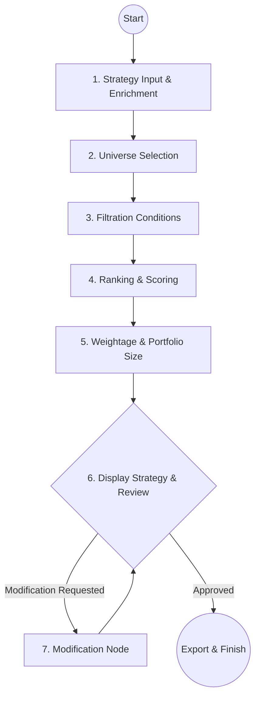

# 📊 Kalpi.ai Strategy Builder — Multi-Agent Quantitative Trading Planner

An automated, multi-agent AI assistant designed to translate natural-language trading and investment ideas into precise, implementation-ready quantitative strategies for Indian equities. 

Powered by **LangGraph**, **LangChain**, and **FastAPI**, this project leverages a multi-node state graph workspace to intelligently select target universes, assign quantitative filtration conditions, define scoring/ranking hierarchies, configure portfolio weighting, and dynamically handle iterative modifications.

---

## ✨ Features & Architecture

The application is built on top of a state-machine architecture using **LangGraph**, allowing for structured, step-by-step reasoning nodes that incrementally build a robust trading strategy.



### 🧠 LangGraph Node Pipeline
1. **Take Input (Strategy Enrichment)**: Takes plain-English strategy ideas (e.g., *"buy high momentum large-cap stocks"*) and enriches them into structured, six-dimensional quant plans specifying core thesis, risk profile, holding intent, and more.
2. **Universe Selection**: Selects the single best matching Indian equity universe (such as `Nifty 50`, `Nifty 500`, `Nifty FNO`, or `Nifty Microcap 250`) based on target market capitalization, liquidity requirements, and strategy risk parameters.
3. **Filter Node**: Infers and validates between 3 and 8 hard numerical filters (e.g. `RSI 14 > 55`, `P/E Ratio < 20`, or `EMA 200` crossovers) using domain-aware range definitions.
4. **Ranking Node**: Recommends quality scoring metrics to rank and differentiate eligible candidate stocks (prioritizing value ratios, momentum scores, or volatility indicators depending on strategy type).
5. **Weightage Node**: Configures whether weights are equal or metric-based (e.g., weighted proportionally to historical earnings growth or market capitalization), and sets the maximum target portfolio size ($N$ stocks).
6. **Display & Modification Nodes**: Handles interactive human-in-the-loop cycles to adjust specific constraints on the fly without breaking the strategy's internal consistency.

---

## 💡 Advanced Highlight: Strategy Conflict Detection (Extra Feature)

This project contains a sophisticated **Conflict Detection engine** built into the modification LLM layer. 

### How It Works:
* When a user requests a strategy modification, the model compares the new instructions against the **Original Core Thesis** and existing constraints on record.
* If a contradiction is detected (e.g., requesting to *"add volatile micro-caps"* to a strategy originally described as a *"stable, conservative large-cap dividend compounder"*), the model explicitly flags it:
  
  > [!IMPORTANT]  
  > ⚠️ **Conflict Detected**: *The model prepends a clear conflict warning (`⚠ Conflict: <one sentence description>`) pointing out the structural mismatch before generating the modified plan.*

### 🔍 Where to Find It:
* **Jupyter Notebook Implementation**: This conflict-checking feature is fully implemented and demonstrated in the Jupyter Notebook file. You can get a closer look at the code, prompt logic, and visual run trace inside the notebook file:
  🔗 **[kalpi_stategy_builder.ipynb](file:///f:/AI%20Projects/kalpi_ai_assignment/kalpi_stategy_builder.ipynb)** *(standardized as `kalpi_strategy_builder.ipynb`)*
* **Status in UI**: Note that while this powerful conflict flag is active in the backend reasoning engine, it is processed as part of the backend state generation and is not directly highlighted in the front-end layout elements, making the Jupyter Notebook the ideal playground to review its execution.

---

## 🛠️ Technology Stack

* **Backend Framework**: [FastAPI](https://fastapi.tiangolo.com/) for building highly-performant, typed REST APIs.
* **Orchestration**: [LangGraph](https://langchain-ai.github.io/langgraph/) & [LangChain](https://www.langchain.com/) for building stateful, multi-agent systems and managing prompt templates.
* **LLM Engine**: Powered by Groq's high-speed API running `llama-3.3-70b-versatile` with an automated primary/secondary API key failover mechanism to bypass rate limits.
* **UI/Frontend**: Premium, fully responsive, glassmorphic dark-mode web client built in vanilla HTML5 and custom-crafted CSS styles, featuring a dynamic visual workflow tracker and one-click JSON exporting.

---

## 🚀 Getting Started

### 1. Prerequisites & Environment Setup
Ensure you have Python 3.10+ installed.

1. Clone or navigate to the project directory:
   ```bash
   cd "f:\AI Projects\kalpi_ai_assignment"
   ```
2. Create and activate a virtual environment:
   ```bash
   python -m venv venv
   # On Windows (PowerShell):
   .\venv\Scripts\Activate.ps1
   # On macOS/Linux:
   source venv/bin/activate
   ```
3. Install dependencies:
   ```bash
   pip install -r requirements.txt
   ```

### 2. Configure Environment Variables
Create a `.env` file in the root directory and add your Groq API keys (two keys are required to support the automated primary/secondary failover mechanism):
```env
GROQ_API_KEY_1=your_primary_groq_api_key
GROQ_API_KEY_2=your_secondary_groq_api_key
```

### 3. Running the Application

#### A. Running the Web App & REST API
Start the FastAPI server using Uvicorn:
```bash
python server.py
```
* The server will spin up at **`http://localhost:8000`**.
* Open your browser and navigate to `http://localhost:8000` to interact with the premium Web UI.
* You can describe your trading strategy, watch the multi-node workflow status light up in real-time, modify constraints, and export the final configuration as `kalpi_strategy.json`.

#### B. Running the Jupyter Notebook
To see the step-by-step logic, custom prompt variables, and the **Conflict Detection** checks in detail:
1. Make sure Jupyter is installed:
   ```bash
   pip install jupyter
   ```
2. Launch the notebook server:
   ```bash
   jupyter notebook
   ```
3. Open and run **`kalpi_stategy_builder.ipynb`** cell by cell.

---

## 📂 Project Structure

```
├── kalpi_chat.html            # Premium glassmorphic web UI
├── server.py                  # FastAPI REST endpoints & workflow handlers
├── kalpi_strategy_builder.py  # LangGraph node definitions & compiled state machine
├── kalpi_stategy_builder.ipynb# Detailed Jupyter Notebook with Conflict Detection logic
├── requirements.txt           # Python project dependencies
├── .env                       # Environment configuration file (API Keys)
└── README.md                  # Project documentation (this file)
```
